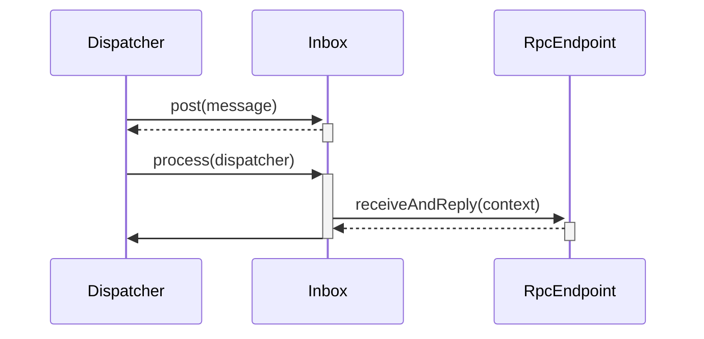

# 消息接收 #

## Inbox ##

Inbox 代表着接收者，一个Inbox对应着一个服务。请求该服务的消息，都由Inbox接收，然后转发给RpcEndpoint处理。




发送给Inbox的消息都会存储到队列里面。后台的线程会从队列处理消息。消息发送的代码很简单，这里讲下处理的过程

## 消息处理 ##

Inbox接收的消息是由InboxMessage类表示，它有几个子类，分别代表着不同的消息类型。对于每种消息，Inbox都会有不同的处理方法。

### OnStart消息 ###

先讲些OnStart消息，这里提下RpcEndpoint有两种类型。一种是支持并发处理消息的，由ThreadSafeRpcEndpoint表示。另一种不支持并发处理，由RpcEndpoint表示。

```scala
  def process(dispatcher: Dispatcher): Unit = {
    .......
    case OnStart =>
      endpoint.onStart()
      if (!endpoint.isInstanceOf[ThreadSafeRpcEndpoint]) {
          inbox.synchronized {
              if (!stopped) {
                  enableConcurrent = true
              }
          }
      }
    .......
  }
```

如果RpcEndpoint是并发的，则设置enableConcurrent为true。

```scala
def process(dispatcher: Dispatcher): Unit = {
    var message: InboxMessage = null
    inbox.synchronized {
      if (!enableConcurrent && numActiveThreads != 0) {
        return
      }
      message = messages.poll()
      if (message != null) {
        numActiveThreads += 1
      } else {
        return
      }
    }
    .......
}
```

可以看到如果enableConcurrent不为true，则不允许多个线程同时处理消息


### RpcMessage消息 ###

```scala
  def process(dispatcher: Dispatcher): Unit = {
		..............
        message match {
          case RpcMessage(_sender, content, context) =>
            try {
              endpoint.receiveAndReply(context).applyOrElse[Any, Unit](content, { msg =>
                throw new SparkException(s"Unsupported message $message from ${_sender}")
              })
            } catch {
              case NonFatal(e) =>
                context.sendFailure(e)
                // Throw the exception -- this exception will be caught by the safelyCall function.
                // The endpoint's onError function will be called.
                throw e
            }
            ............
        }
  }
```

可以看出消息最后转发给RpcEndpoint的receiveAndReply方法。receiveAndReply返回了偏函数，PartialFunction[Any, Unit]， 然后调用偏函数。如果自定义RpcEndpoint，必须实现receiveAndReply方法，使用case语句生成偏函数。


### OnStop消息 ###

当接收到到OnStop消息时，会调用dispatcher方法，注销掉这个RpcEndpoint

```scala
def process(dispatcher: Dispatcher): Unit = {
    .......
    case OnStop =>
            val activeThreads = inbox.synchronized { inbox.numActiveThreads }
            assert(activeThreads == 1,
              s"There should be only a single active thread but found $activeThreads threads.")
            dispatcher.removeRpcEndpointRef(endpoint)
            endpoint.onStop()
            assert(isEmpty, "OnStop should be the last message")
    ......
}
```


### 消息处理线程 ###

首先看Inbox的process方法，它会循环从队列里获取和处理消息。 

```scala
  def process(dispatcher: Dispatcher): Unit = {
      while (true) {
          message match {
              ......
          }
          
          message = messages.poll()
          // 如果队列消息消费完毕，则退出
          if (message == null) {
            numActiveThreads -= 1
            return
        }
      }
      
```

处理消息是通过线程池处理，MessageLoop是线程运行的主要逻辑。MessageLoop是属于Dispatcher里的类。

这里提下Dispatcher有个队列receivers，存放着EndpointData数据。EndpointData包含了Endpoint的相关信息，比如inbox属性。当Dispatcher向Inbox发送消息时，都会在队列里添加EndpointData。

```scala
  private class MessageLoop extends Runnable {
    override def run(): Unit = {
      try {
        while (true) {
          try {
            val data = receivers.take()
            if (data == PoisonPill) {
              // Put PoisonPill back so that other MessageLoops can see it.
              receivers.offer(PoisonPill)
              return
            }
            data.inbox.process(Dispatcher.this)
          } catch {
            case NonFatal(e) => logError(e.getMessage, e)
          }
        }
      } catch {
        case ie: InterruptedException => // exit
      }
    }
  }
```

MessageLoop会循环从receivers中获取EndpointData，然后调用Inbox的process方法处理消息。

线程池的实例化由Dispatcher负责

```scala
private val threadpool: ThreadPoolExecutor = {
    val numThreads = nettyEnv.conf.getInt("spark.rpc.netty.dispatcher.numThreads",
      math.max(2, Runtime.getRuntime.availableProcessors()))
    val pool = ThreadUtils.newDaemonFixedThreadPool(numThreads, "dispatcher-event-loop")
    for (i <- 0 until numThreads) {
      pool.execute(new MessageLoop)
    }
    pool
  }
```

