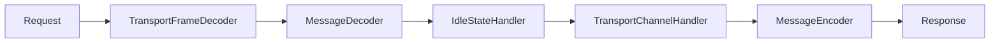
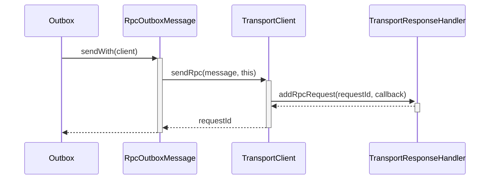

# spark rpc 原理 #


## netty初始化 ##

spark rpc是基于netty框架的, spark rpc的客户端是TransportClient表示。通过TransportClient的建立，可以看到它是netty的初始化过程。

```java
public class TransportClientFactory  
  private TransportClient createClient(InetSocketAddress address)
      throws IOException, InterruptedException {
	// 初始化BootStrap
    Bootstrap bootstrap = new Bootstrap();
    // 设置eventloop
    bootstrap.group(workerGroup)
        // 指定Channel Class
      .channel(socketChannelClass)
      // Disable Nagle's Algorithm since we don't want packets to wait
      .option(ChannelOption.TCP_NODELAY, true)
      .option(ChannelOption.SO_KEEPALIVE, true)
      .option(ChannelOption.CONNECT_TIMEOUT_MILLIS, conf.connectionTimeoutMs())
      .option(ChannelOption.ALLOCATOR, pooledAllocator);
      
     // 初始化 Channel
    bootstrap.handler(new ChannelInitializer<SocketChannel>() {
      @Override
      public void initChannel(SocketChannel ch) {
         // 调用TransportContext来初始化Channel
        TransportChannelHandler clientHandler = context.initializePipeline(ch);
      }
    });

	.......
  }
}
```

接着进入TransportContex的initializePipeline方法

```java
public class TransportContext {  
  	private static final MessageEncoder ENCODER = MessageEncoder.INSTANCE;
  	private static final MessageDecoder DECODER = MessageDecoder.INSTANCE;

	public TransportChannelHandler initializePipeline(SocketChannel channel, RpcHandler channelRpcHandler) {
    	try {
          TransportChannelHandler channelHandler = createChannelHandler(channel, channelRpcHandler);
          channel.pipeline()
            .addLast("encoder", ENCODER) // 添加MessageEncoder
             // 添加frame解码
            .addLast(TransportFrameDecoder.HANDLER_NAME, NettyUtils.createFrameDecoder())
            .addLast("decoder", DECODER) // 添加MessageDecoder
             // 添加IdleStateHandler
            .addLast("idleStateHandler", new IdleStateHandler(0, 0, conf.connectionTimeoutMs() / 1000))
             // 添加TransportChannelHandler
            .addLast("handler", channelHandler);
          return channelHandler;
        } catch (RuntimeException e) {
          logger.error("Error while initializing Netty pipeline", e);
          throw e;
        }
  	}
}
```


netty的ChannelHandler调用链如图：




## Channel Handler介绍 ##

接下来按照顺序，了解这些ChannelHandler的作用

### TransportFrameDecoder ###

数据的格式为

```shell
-----------|-------------
   size    |   data
-----------|------------
 8 byte    | size byte
-----------| -----------
```


spark 通信的基本单位是Frame，它把发送的信息分成多块Frame，然后发送。TransportFrameDecoder负责将一整个Frame完整的读取出来。

```java
public class TransportFrameDecoder extends ChannelInboundHandlerAdapter {
  // Bytebuf列表，存储了从socket中读取的数据，但是没有被解析
  private final LinkedList<ByteBuf> buffers = new LinkedList<>();
  private long totalSize = 0; // 未解析的数据大小

  public void channelRead(ChannelHandlerContext ctx, Object data) throws Exception {
    ByteBuf in = (ByteBuf) data;
    // 添加至buffers列表
    buffers.add(in);
    // 更新totalSize
    totalSize += in.readableBytes();

    while (!buffers.isEmpty()) {
      // First, feed the interceptor, and if it's still, active, try again.
      if (interceptor != null) {
        ByteBuf first = buffers.getFirst();
        int available = first.readableBytes();
        if (feedInterceptor(first)) {
          assert !first.isReadable() : "Interceptor still active but buffer has data.";
        }

        int read = available - first.readableBytes();
        if (read == available) {
          buffers.removeFirst().release();
        }
        totalSize -= read;
      } else {
        // Interceptor is not active, so try to decode one frame.
        ByteBuf frame = decodeNext();
        // decodeNext返回null， 表示没有解析完。则不向下个ChannelHandler传递数据
        if (frame == null) {
          break;
        }
        // 将解析完的frame传递给下个ChannelHandler
        ctx.fireChannelRead(frame);
      }
    }
  }
```


```java
public class TransportFrameDecoder extends ChannelInboundHandlerAdapter {
    private static final int LENGTH_SIZE = 8;
  	private long nextFrameSize = UNKNOWN_FRAME_SIZE; // 下个frame的size
    
    private ByteBuf decodeNext() throws Exception {
        // 解析frame的size内容
        long frameSize = decodeFrameSize();
        // 如果frameSize没有解析出来
        // totalSize < frameSize，表示未读取的数据长度小于frame size，不能后完整的解析frame
        if (frameSize == UNKNOWN_FRAME_SIZE || totalSize < frameSize) {
          return null;
        }

        // Reset size for next frame.
        nextFrameSize = UNKNOWN_FRAME_SIZE;

        Preconditions.checkArgument(frameSize < MAX_FRAME_SIZE, "Too large frame: %s", frameSize);
        Preconditions.checkArgument(frameSize > 0, "Frame length should be positive: %s", frameSize);
 
        // 如果buffers列表的第一个Bytebuf有足够的数据，直接解析
        int remaining = (int) frameSize;
        if (buffers.getFirst().readableBytes() >= remaining) {
          return nextBufferForFrame(remaining);
        }

        // 循环遍历buffers，直到frame的数据读取完
        CompositeByteBuf frame = buffers.getFirst().alloc().compositeBuffer(Integer.MAX_VALUE);
        while (remaining > 0) {
          ByteBuf next = nextBufferForFrame(remaining);
          remaining -= next.readableBytes();
          frame.addComponent(next).writerIndex(frame.writerIndex() + next.readableBytes());
        }
        assert remaining == 0;
        return frame;
      }
    
}
```

decodeFrameSize方法

```java
  private long decodeFrameSize() {
    //  nextFrameSize 如果不为UNKNOWN_FRAME_SIZE， 即表示已经解析出来了
    // totalSize小于8，表示未读取的数据小于需要的8位，不能够解析nextFrameSize
    if (nextFrameSize != UNKNOWN_FRAME_SIZE || totalSize < LENGTH_SIZE) {
      return nextFrameSize;
    }

    // 如果buffers列表的第一个Bytebuf，大于8个字节，则直接读取
    ByteBuf first = buffers.getFirst();
    if (first.readableBytes() >= LENGTH_SIZE) {
      nextFrameSize = first.readLong() - LENGTH_SIZE;
      totalSize -= LENGTH_SIZE;
      if (!first.isReadable()) {
        buffers.removeFirst().release();
      }
      return nextFrameSize;
    }
      
	// 循环读取buffers的列表，直到读取8个字节
    while (frameLenBuf.readableBytes() < LENGTH_SIZE) {
      ByteBuf next = buffers.getFirst();
      int toRead = Math.min(next.readableBytes(), LENGTH_SIZE - frameLenBuf.readableBytes());
      frameLenBuf.writeBytes(next, toRead);
      if (!next.isReadable()) {
        buffers.removeFirst().release();
      }
    }
	// 解析出nextFrameSize
    nextFrameSize = frameLenBuf.readLong() - LENGTH_SIZE;
    totalSize -= LENGTH_SIZE;
    frameLenBuf.clear();
    return nextFrameSize;
  }
```


### MessageDecoder ###

MessageDecoder接收从TransportFrameDecoder解析完的Frame数据。然后将Frame解析成Message，最后给TransportChannelHandler处理。

Message的数据格式

```shell
-----------|-------------
   type    |   data
-----------|------------
 1 byte    |   
-----------| -----------
```

```java
public final class MessageDecoder extends MessageToMessageDecoder<ByteBuf> {
    @Override
    public void decode(ChannelHandlerContext ctx, ByteBuf in, List<Object> out) {
        // 读取message type
        Message.Type msgType = Message.Type.decode(in);
        // 根据type的种类，调用不同类型的解析
        Message decoded = decode(msgType, in);
        assert decoded.type() == msgType;
        logger.trace("Received message {}: {}", msgType, decoded);
        out.add(decoded);
      }
    
    private Message decode(Message.Type msgType, ByteBuf in) {
        switch (msgType) {
            case ChunkFetchRequest:
                return ChunkFetchRequest.decode(in);
                ......
        }
    }
}
```


### TransportChannelHandler ###

它将消息分为两类，RequestMessage和ResponseMessage，分别分发给TransportRequestHandler和TransportResponseHandler处理。

```java
  private final Map<Long, RpcResponseCallback> outstandingRpcs;
  public void handle(ResponseMessage message) throws Exception {
    .......
    if (message instanceof RpcResponse) {
      RpcResponse resp = (RpcResponse) message;
      RpcResponseCallback listener = outstandingRpcs.get(resp.requestId);
      if (listener == null) {
        logger.warn("Ignoring response for RPC {} from {} ({} bytes) since it is not outstanding",
          resp.requestId, getRemoteAddress(channel), resp.body().size());
      } else {
        outstandingRpcs.remove(resp.requestId);
        try {
          listener.onSuccess(resp.body().nioByteBuffer());
        } finally {
          resp.body().release();
        }
      }
    }
```

outstandingRpcs是由requestId和回调函数组成的Map。当接收响应时，会根据请求id找到相应的回调函数，然后调用它。


### MessageEncoder ###

它负责将消息编码成frame格式发送

```shell
----------------------------------------------------------
frame size | message type | message header | message body
----------------------------------------------------------
8 byte     |  1 byte      |  变长           | 变长
----------------------------------------------------------
```

message header和body部分，根据不同类型的，格式也不一样。注意body部分，有些Message没有。

以RpcRequest消息为例, 它包含了body部分。它的header部分，分为requestId和body length。

```shell
----------------------------------------------------------------------------
frame size | message type   |        message header      | message body
----------------------------------------------------------------------------
frame size |  message type  |  requestId  | body length  | message body
----------------------------------------------------------------------------
8 byte     |  1 byte        |  4 byte     |  变长         | 长度为body length
----------------------------------------------------------------------------
```

以RpcFailure为例，它不包含body部分。他的header部分，分为requestId和错误信息

```shell
--------------------------------------------------------------------
frame size | message type   |        message header      
--------------------------------------------------------------------
frame size |  message type  |  requestId  | error string
--------------------------------------------------------------------
8 byte     |  1 byte        |  4 byte     |  变长         
--------------------------------------------------------------------
```

因为MessageEncoder原理比较简单，所以不做详细介绍。

## 消息发送的过程 ##



RpcOutboxMessage调用TransportClient的sendRpc方法，并将自己注册为回调函数。

```scala
class RpcOutboxMessage(  
  override def sendWith(client: TransportClient): Unit = {
    this.client = client
    this.requestId = client.sendRpc(content, this)
  }
}
```

TransportClient的sendRpc方法，随机生成requestId，然后在TransportResponseHandler注册回调函数，并且使用Channel发送请求。

```java
public long sendRpc(ByteBuffer message, RpcResponseCallback callback) {
    long startTime = System.currentTimeMillis();
    if (logger.isTraceEnabled()) {
      logger.trace("Sending RPC to {}", getRemoteAddress(channel));
    }
	// 使用uuid生成requestId
    long requestId = Math.abs(UUID.randomUUID().getLeastSignificantBits());
    // 注册这个请求的回调函数
    handler.addRpcRequest(requestId, callback);
	// 调用Channel发送数据
    channel.writeAndFlush(new RpcRequest(requestId, new NioManagedBuffer(message)))
    	// 添加回调函数，当请求成功时，打印请求的耗时时间。
        // 当失败时，关闭Channel，注销回调函数，调用回调函数的onFailure
        .addListener(future -> {
          if (future.isSuccess()) {
            long timeTaken = System.currentTimeMillis() - startTime;
            if (logger.isTraceEnabled()) {
              logger.trace("Sending request {} to {} took {} ms", requestId,
                getRemoteAddress(channel), timeTaken);
            }
          } else {
            ......
                
            handler.removeRpcRequest(requestId);
            channel.close();
            try {
              callback.onFailure(new IOException(errorMsg, future.cause()));
            } catch (Exception e) {
              logger.error("Uncaught exception in RPC response callback handler!", e);
            }
          }
        });

    return requestId;
  }
```

