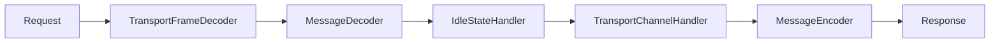

# spark rpc 原理 #


## netty 初始化 ##

spark rpc是基于netty框架的, spark rpc的客户端是TransportClient表示。通过TransportClient的建立，可以看到它是netty的初始化过程。

netty的ChannelHandler调用链如图：




## 消息格式

```shell
----------------------------------------------------------
frame size |   type   |  header  |     body
----------------------------------------------------------
8 byte     |  1 byte  |   变长   |      变长
----------------------------------------------------------
```

frame size 表示后面的数据长度，至少包括 type 和 header，有些消息还会包含 message body。netty 在解析消息时，必须至少读取到 frame size 长度的数据，才能消息请求。

header 和 body 部分，根据消息种类的不同，格式也不一样。有些消息没有 body 。

比如 RpcRequest 消息, 它的 frame size 表示 type，header 和 body 三部分的总长度。

StreamResponse 消息，它的 frame size 只表示 type 和 header 两部分的长度。

而RpcFailure  消息，只有 header 部分。


## Channel Handler介绍 ##

接下来按照顺序，了解这些ChannelHandler的作用

### TransportFrameDecoder ###

TransportFrameDecoder 负责解析消息，它会保证读取完 frame size 大小的数据长度，才会进一步传递给下个 Handler 处理。在读取的数据小于 frame size，它会将数据存到缓存里。所以使用这种方式，必须要能保证 frame size 较小。

从上面的消息格式看到，只有 header 和 body 两部分的数据是变长的。header 数据都比较小，而 body 数据长度根据消息的类型不同。比如 RpcRequest 消息表示 rpc 请求消息，它的 body 长度可以认为比较小。而 StreamResponse 消息表示 shuffle 数据传输，一般都比较大，所以它的 framesize 不包括 body。

TransportFrameDecoder 有一个特殊的 Interceptor 实例，当数据特别大时，负责处理 body 数据。

1. TransportFrameDecoder 负责读取完 type 和 header 数据，然后传递给下个 Handler 处理
2. 当最终的 TransportChannelHandler 接收到上一部传来的数据后，它会根据消息类型，实例化出 Interceptor 对象，存放到 TransportFrameDecoder，负责处理 body 数据。
3. 当 body 数据处理完后，就把 Interceptor 实例设置为 null。


### MessageDecoder ###

MessageDecoder 接收上一步传来的数据，负责根据 type 字段，实例化对应的消息。之后传递 TransportChannelHandler处理。消息类型如下：

```java
enum Type implements Encodable {
  ChunkFetchRequest(0), ChunkFetchSuccess(1), ChunkFetchFailure(2),
  RpcRequest(3), RpcResponse(4), RpcFailure(5),
  StreamRequest(6), StreamResponse(7), StreamFailure(8),
  OneWayMessage(9);
}
```


### MessageEncoder

它负责将消息编码成上述格式，因为MessageEncoder原理比较简单，所以不做详细介绍。


### IdleStateHandler

这个 Handler 是 netty 内置的，用于长连接中，客户端和服务端发送心跳包，表示自身还存活。


## 核心处理 Handler 

TransportChannelHandler 是最为核心的 Handler，它根据请求消息和响应消息，分为两种处理方式。以 rpc 消息为例，服务端会处理请求消息，而客户端会负责处理响应消息。

## 请求消息处理

TransportRequestHandler 类会负责处理请求消息。根据消息类型不同，处理的程序也不一样。

### Rpc 请求消息

这类消息表示由客户端发过来的请求，它会被 RpcHandler 处理。


### Chunk 请求消息

这类消息表示由客户端发过来的请求，它会被 StreamManager 处理。


### Stream 请求消息

这类消息表示由客户端发过来的请求，它会被 StreamManager 处理。

 

## 响应消息处理

TransportResponseHandler 类会负责处理响应消息。根据消息类型不同，处理的程序也不一样。

### Rpc 响应消息

这类消息是客户端发起 rpc 请求返回的响应，它有一个 requestId 来标识自己。客户端发起请求时，会生成一个唯一的 requestId，并且还会保存回调函数。这样当收到响应时，就根据 requestId 执行对应的回调函数。


### Chunk 响应消息

Chunk 消息用来传输数据用的，它有一个 StreamChunkId 用来标识自己。客户端在发起Chunk 请求消息时，会保存这个消息的回调函数。这样当收到响应时，就根据 StreamChunkId 执行对应的回调函数。


### Stream 响应消息

Stream 消息用来传输大数据。它发送请求时，必须按照顺序发送。因为存储 Stream 响应消息的回调函数，是用队列存储的。

StreamResponse 消息的 frame size 是不包括 body 数据的，所以它在读取完 header 数据的时候，生成了 StreamInterceptor 实例负责处理 body 数据。然后把 StreamInterceptor 实例保存到 TransportFrameDecoder 里，等待调用。


## 消息种类


Chunk ------------------- StreamManager

Stream ----------------- StreamManager

Rpc  -------------- Rpchandler

