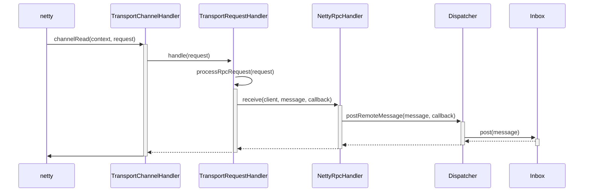

# 服务端介绍 #


## 数据流

服务端响应请求的调用时序图




## TransportRequestHandler ##

TransportChannelHandler是netty初始化ChannelHandler的，它有一个重要的属性TransportRequestHandler，专门负责处理客户端的请求。

```java
  private void processRpcRequest(final RpcRequest req) {
    try {
      rpcHandler.receive(reverseClient, req.body().nioByteBuffer(), new RpcResponseCallback() {
        @Override
        public void onSuccess(ByteBuffer response) {
          respond(new RpcResponse(req.requestId, new NioManagedBuffer(response)));
        }

        @Override
        public void onFailure(Throwable e) {
          respond(new RpcFailure(req.requestId, Throwables.getStackTraceAsString(e)));
        }
      });
    } catch (Exception e) {
      logger.error("Error while invoking RpcHandler#receive() on RPC id " + req.requestId, e);
      respond(new RpcFailure(req.requestId, Throwables.getStackTraceAsString(e)));
    } finally {
      req.body().release();
    }
  }
```

注意上面实例化了RpcResponseCallback的子类。RpcResponseCallback有两个回调方法，分别在成功和失败时调用。两个方法都用了respond方法，发送响应。respond方法本质是调用了netty的Channel，writeAndFlush方法发送数据。

## NettyRpcHandler ##

NettyRpcHandler的receive方法，首先调用了internalReceive生成RequestMessage，然后转发给dispatcher。

NettyRpcHandler还有个属性remoteAddresses，它保存了client的地址。通过remoteAddresses， 可以确定这个client是否为新连接。每当新的client连接时，都会发送一个RemoteProcessConnected消息。

```scala
private[netty] class NettyRpcHandler(
  override def receive(
      client: TransportClient,
      message: ByteBuffer,
      callback: RpcResponseCallback): Unit = {
    val messageToDispatch = internalReceive(client, message)
    dispatcher.postRemoteMessage(messageToDispatch, callback)
  }

  private def internalReceive(client: TransportClient, message: ByteBuffer): 		      RequestMessage = {
    val addr = client.getChannel().remoteAddress().asInstanceOf[InetSocketAddress]
    assert(addr != null)
    val clientAddr = RpcAddress(addr.getHostString, addr.getPort)
    val requestMessage = RequestMessage(nettyEnv, client, message)
    if (requestMessage.senderAddress == null) {
      // client和server在同一个进程
      new RequestMessage(clientAddr, requestMessage.receiver, requestMessage.content)
    } else {
      val remoteEnvAddress = requestMessage.senderAddress
      if (remoteAddresses.putIfAbsent(clientAddr, remoteEnvAddress) == null) {
        //  如果是新连接的client，给所有的endpoint发送消息
        dispatcher.postToAll(RemoteProcessConnected(remoteEnvAddress))
      }
      requestMessage
    }
  }

```


## Dispatcher ##

```scala
  /** Posts a message sent by a remote endpoint. */
  def postRemoteMessage(message: RequestMessage, callback: RpcResponseCallback): Unit = {
    val rpcCallContext =
      new RemoteNettyRpcCallContext(nettyEnv, callback, message.senderAddress)
    val rpcMessage = RpcMessage(message.senderAddress, message.content, rpcCallContext)
    postMessage(message.receiver.name, rpcMessage, (e) => callback.onFailure(e))
  }


  private def postMessage(
      endpointName: String,
      message: InboxMessage,
      callbackIfStopped: (Exception) => Unit): Unit = {
    val error = synchronized {
      val data = endpoints.get(endpointName)
      if (stopped) {
        Some(new RpcEnvStoppedException())
      } else if (data == null) {
        Some(new SparkException(s"Could not find $endpointName."))
      } else {
        // 调用Inbox发送消息
        data.inbox.post(message)
        receivers.offer(data)
        None
      }
    }
    // We don't need to call `onStop` in the `synchronized` block
    error.foreach(callbackIfStopped)
  }
```


这里注意到RemoteNettyRpcCallContext， 当我们实现rpc Endpoint的时候，需要调用它的send或reply方法，返回数据。

```scala
private[netty] class RemoteNettyRpcCallContext(
    nettyEnv: NettyRpcEnv,
    callback: RpcResponseCallback,
    senderAddress: RpcAddress)
  extends NettyRpcCallContext(senderAddress) {

  override protected def send(message: Any): Unit = {
    val reply = nettyEnv.serialize(message)
    callback.onSuccess(reply)
  }
}
```

这里send方法，是调用了RpcResponseCallback回调函数。callback的定义，在TransportRequestHandler的processRpcRequest方法里。这里调用了TransportRequestHandler的respond方法。

```java
@Override
public void onSuccess(ByteBuffer response) {
    respond(new RpcResponse(req.requestId, new NioManagedBuffer(response)));
}
```

respond方法，调用Channel的writeAndFlush将数据发送出去。

```java
  private void respond(Encodable result) {
    SocketAddress remoteAddress = channel.remoteAddress();
    channel.writeAndFlush(result).addListener(future -> {
      if (future.isSuccess()) {
        logger.trace("Sent result {} to client {}", result, remoteAddress);
      } else {
        logger.error(String.format("Error sending result %s to %s; closing connection",
          result, remoteAddress), future.cause());
        channel.close();
      }
    });
  }
```

