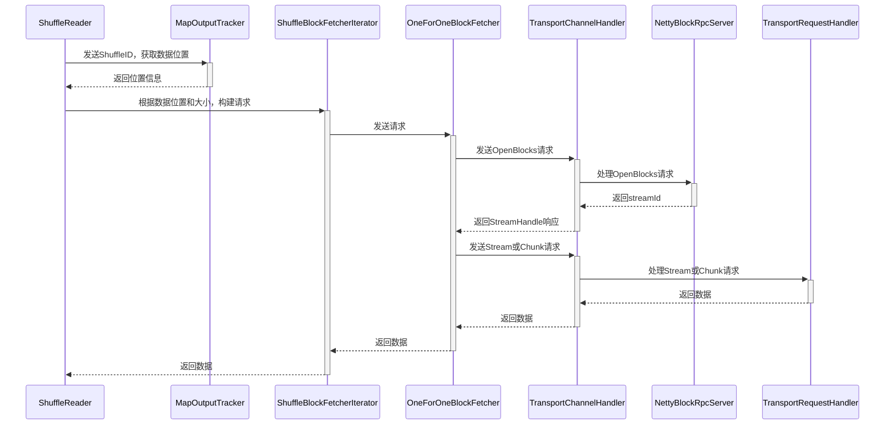

## 读取流程




1. shuffle 数据的位置获取，从MapOutputTracker获取数据所在的位置。

2. ShuffleBlockFetcherIterator 根据 shuffle 数据的位置，构建远程请求。

3. OneForOneBlockFetcher 负责发送请求，它需要向请求OpenBlocks，会收到StreamHandler响应。

4. NettyBlockRpcServer 负责处理OpenBlocks请求，会根据blockId 列表，找到对应的文件。并且生成streamId，这样客户端通过 streamId 就可以获取数据了。

5. OneForOneBlockFetcher 接收到StreamHandler相应后。如果指定了要将数据存储到文件，那么就发送Stream请求。否则发送Chunk请求，数据会保存在内存中。

6. TransportRequestHandler 处理 Stream 或Chunk 请求，会通过 StreamManager 返回数据。


## 生成请求

首先根据 shuffle 数据所在的位置，分为本地数据和远程数据。本地数据直接从文件中即可读取，而远程数据需要通过网络传输。ShuffleBlockFetcherIterator 作为一个迭代器，会先返回本地数据，然后返回远程数据。这样也就减少了等待远程数据的传输时间。


### 生成远程请求

至于远程的shuffle数据，首先根据所在位置进行分组。然后将组里的数据，根据大小进一步分组。一个请求包含了多份 shuffle 数据，这些数据总和，基本控制在相同的大小。这里举个例子说明，假设有多列数据，目标大小为100MB。

| 数据名称 | 位置 | 大小  |
| -------- | ---- | ----- |
| A1       | A    | 80MB  |
| A2       | A    | 40MB  |
| A3       | A    | 50MB  |
| B1       | B    | 120MB |

  	

结果分为下列三个请求

| 请求ID | 数据列表 |
| ------ | -------- |
| 0      | A1, A2   |
| 1      | A3       |
| 2      | B1       |

首先来看位置 A 的数据，依次遍历它的三份数据 A1，A2，A3，首先 A1 和 A2 的数据大小之和，大于 100MB，所以生成第一个请求。然后只剩下 A3 一份请求在位置 A上，所以生成第二个请求。B位置的数据同理，生成第三个请求。


### 并发请求

上面已经生成了请求，现在如何将其高效率的发送出去。通常我们都是采用异步的方式，spark 也是基于 Netty 来实现异步传输的。但是同时 spark 在此基础上，还实现了并发的限制，防止占用过大的资源。

- 正在发送的请求数，不能超过指定数量，由 spark.reducer.maxReqsInFlight 配置表示，默认 Int.MaxValue，可以认为无限制。

- 正在请求的数据大小总和，不能超过指定数量，由spark.reducer.maxSizeInFlight 配置表示，默认为 48MB。


对于请求的数据过大时，spark 会使用 stream 模式请求，也就是将数据存储到文件里。

对于数据较小的情况，spark 会将数据全部存储到内存里。

这个阈值由 spark.reducer.maxReqSizeShuffleToMem 配置指定，比较奇怪的是默认值为Long.MaxValue，几乎是无限大。如果发生了shuffle 倾斜，这就很容易造成内存溢出了。建议修改配置的值大小，不要超过 Executor 的本地内存大小。如果使用 Yarn 资源调度，可以参考此篇博客，了解内存分配的原理。


## 远程传输


## ShuffleClient 类图

%plantuml%

@startuml
abstract class ShuffleClient
class BlockTransferService
class NettyBlockTransferService
class ExternalShuffleClient
class MesosExternalShuffleClient

ShuffleClient <|-- BlockTransferService
BlockTransferService <|-- NettyBlockTransferService
ShuffleClient <|-- ExternalShuffleClient
ExternalShuffleClient <|-- MesosExternalShuffleClient

@enduml

%plantuml%

ShuffleClient表示shuffle 数据的客户端，支持远程读取数据。

BlockTransferService继承ShuffleClient，增加了上传数据。

NettyBlockTransferService继承BlockTransferService， 实现了所有的接口。

ExternalShuffleClient 实现外部 ShuffleService 的连接。


## 发送请求

NettyBlockTransferService 使用 OneForOneBlockFetcher 远程获取shuffle数据。

首先发送 OpenBlocks rpc 请求，

```java
public class OpenBlocks extends BlockTransferMessage {
  public final String appId; // 
  public final String execId;  // executor id
  public final String[] blockIds; // 获取的block id列表
}
```

响应 StreamHandle

```java
public class StreamHandle extends BlockTransferMessage {
  public final long streamId; // 分配的stream id
  public final int numChunks; // 多少块 
}
```


如果指定了文件名，那么表示接收的数据需要存储到文件。所以会以 stream 的方式请求数据。

否则就采用fetch的方式请求数据，数据会先存到内存里。如果数据过大，就会造成内存溢出。

```java
private class DownloadCallback implements StreamCallback {
    private WritableByteChannel channel = null;
    
    // 只要接收到数据，就会立马写入到文件中
    public void onData(String streamId, ByteBuffer buf) throws IOException {
        channel.write(buf);
    }
    
    // 获取数据完成后，会通知listener
    public void onComplete(String streamId) throws IOException {
        channel.close();
        // 基于文件封装的buffer
        ManagedBuffer buffer = new FileSegmentManagedBuffer(transportConf, targetFile, 0, targetFile.length());
        // 执行listener回调函数
        listener.onBlockFetchSuccess(blockIds[chunkIndex], buffer);
    }
}
```


```java
private class ChunkCallback implements ChunkReceivedCallback {
    // buffer是netty分配的堆外内存
    public void onSuccess(int chunkIndex, ManagedBuffer buffer) {
        listener.onBlockFetchSuccess(blockIds[chunkIndex], buffer);
    }
}
```


## 服务端处理请求 ##

NettyBlockTransferService 类不仅作实现了客户端的接口，同样它还负责创建服务端的实例。服务端是基于 netty 框架实现的，它的核心处理 由 NettyBlockRpcServer 类负责。


注意到NettyBlockRpcServer，它继承了RpcHandler，实现了处理请求的逻辑。NettyBlockRpcServer只接收OpenBlocks和UploadBlock请求。

```scala
class NettyBlockRpcServer(appId: String, serializer: Serializer, blockManager: BlockDataManager) extends RpcHandler with Logging {
    override def receive(
      client: TransportClient, rpcMessage: ByteBuffer, responseContext: RpcResponseCallback): Unit = {
    	val message = BlockTransferMessage.Decoder.fromByteBuffer(rpcMessage)
    	logTrace(s"Received request: $message")

    	message match {
            case openBlocks: OpenBlocks =>
                val blocksNum = openBlocks.blockIds.length
                // 针对每个blockId，生成FileSegmentManagedBuffer
                val blocks = for (i <- (0 until blocksNum).view)
                  yield blockManager.getBlockData(BlockId.apply(openBlocks.blockIds(i)))
            	// 生成streamId，并且在StreamManager注册
            	val streamId = streamManager.registerStream(appId, blocks.iterator.asJava)
            	// 响应StreamHandle结果
            	responseContext.onSuccess(new StreamHandle(streamId, blocksNum).toByteBuffer)
            
            case uploadBlock: UploadBlock =>
            	val data = new NioManagedBuffer(ByteBuffer.wrap(uploadBlock.blockData))
            	val blockId = BlockId(uploadBlock.blockId)
        		//  调用blockManager写入数据
            	blockManager.putBlockData(blockId, data, level, classTag)
        		responseContext.onSuccess(ByteBuffer.allocate(0))
        }
    }
  }
```


## StreamManager

StreamManager 有两个子类，NettyStreamManager 和 OneForOneStreamManager。

NettyStreamManager 用于传输配置文件或 jar 包。

目前 NettyBlockRpcServer 使用的是 OneForOneStreamManager，负责shuffle 数据的服务端。

```java
public class OneForOneStreamManager extends StreamManager {
  // 用来生成递增唯一的streamId
  private final AtomicLong nextStreamId;
  // 根据streamId 找到对应的数据，数据由StreamState表示
  private final ConcurrentHashMap<Long, StreamState> streams;
  
  // 注册stream数据
  public long registerStream(String appId, Iterator<ManagedBuffer> buffers) {
    // 生成streamId
    long myStreamId = nextStreamId.getAndIncrement();
    streams.put(myStreamId, new StreamState(appId, buffers));
    return myStreamId;
  }
}
```


对于Chunk 请求或 Stream 请求，都会指明streamId 和 chunk_index。OneForOneStreamManager 会根据 streamId，找到对应的数据列表，根据 chunk_index 找到列表中的元素。之后使用零拷贝的技术，实现文件到socket的传输。

NettyBlockRpcServer 接收到OpenBlocks请求时，就会根据 blockId 列表，找到对应的数据，生成FileSegmentManagedBuffer 列表。这些ManagedBuffer会存储到StreamManager里。


## 客户处理响应 ##

### 读取请求 ###

NettyBlockTransferService也实现了客户端的接口。fetchBlocks负责读取远端 Block。这里请求支持失败重试，这里涉及到了RetryingBlockFetcher。RetryingBlockFetcher的原理是当请求失败后，会将请求丢到后台的线程继续尝试。


OneForOneBlockFetcher，首先根据BlockIds生成请求OpenBlocks，调用client的sendRpc发送请求。收到的响应消息是StreamHandle，它包含了streamId，和ChunkId列表。然后客户端会再去请求Chunk的数据。如果shuffleFiles不为空，表示这些数据都要存到文件里，这里client调用stream方法。否则，这些数据会存到内存里，这里client调用fetchChunk方法。


### 写请求 ###

uploadBlock方法实现了请求写Block，它简单的调用了client.sendRpc，发送UploadBlock请求消息。

