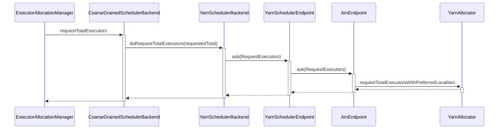

## 申请资源



## 


## YarnAllocator

AMEndpoint关于资源的请求，都会转发给YarnAllocator处理。YarnAllocator主要负责ApplicationMaster和ResourceManager的通信。

首先简单的介绍下AMRMClient的使用，它是Yarn库里的类，提供了与ResourceManager通信的api。下面是一个简单的例子：

```java
// 实例化AMRMClient
AMRMClient<ContainerRequest> amClient = AMRMClient.createAMRMClient();
// 指定请求资源大小，内存和cpu
Resource resource = Resource.newInstance(memory, cores);
// 希望请求所在的主机
String[] nodes = {"node1", "node2"};
// 希望请求所在的机架，如果没有要求，则设为null
String[] rack = null;
// 指定优先值
Priority priority = Priority.newInstance(1);
// 当资源不满足时，是否可以降级要求。比如指定主机node1不满足时，可以降级到node1所在机架的其它主机
Boolean relaxLocality = True;
// 实例化 ContainerRequest
ContainerRequest request = new ContainerRequest(resources, nodes, rack, priority);
// 添加 ContainerRequest 到 amClient里，等待allocate函数发出申请
amClient.addContainerRequest(request);
// allocate会将ContainerRequest请求发送给ResourceManager，同时也会维持心跳
amClient.allocate(0.1);
```


## 申请资源算法

Yarn申请资源时候，可以指定资源的位置，比如host和rack。spark会根据任务的位置请求，申请不同的ContainerRequest。算法如下：

首先介绍输入变量：

- numContainer， 申请Container的数目
- numLocalityAwareTasks ， 有位置要求的任务的数目
- hostToLocalTaskCount ： Map[String, Int] ， 每个host需要运行的任务数目
- allocatedHostToContainersMap ： HashMap[String, Set[ContainerId]] ， 已经每个host包含已经分配的Container
- localityMatchedPendingAllocations ： Seq[ContainerRequest] ， 即将请求的ContainerRequest

首先从即将请求的ContainerRequest，计算每个host对应的请求数。然后根据hostToLocalTaskCount和allocatedHostToContainersMap， 计算出真正需要请求分布。

### 计算localityMatchedPendingAllocations的分布

localityMatchedPendingAllocations包含了多个ContainerRequest， 每个ContainerRequest可以指定多个host的位置，表示满足其中一个host即可。

关于计算分布的原理，举个简单例子。下列表示有3个ContainerRequest， 里面的 符号 * 表示ContainerRequest包含的host

|                    | Host 1 | Host 2 | Host 3 | Host 4 |
| ------------------ | :----: | :----: | :----: | :----: |
| ContainerRequest 0 |   *    |   *    |        |        |
| ContainerRequest 1 |   *    |   *    |   *    |        |
| ContainerRequest 2 |   *    |        |   *    |   *    |

首先计算各个Host可以满足ContainerRequest的数目，这样就形成下面的数据

| Host 1 |  3   |
| :----: | :--: |
| Host 2 |  2   |
| Host 3 |  2   |
| Host 4 |  1   |

然后计算计算权重值, 表示了每个Host的运行任务权重比

| Host 1 | 3 / (3 +2+2+1) |
| :----: | :------------: |
| Host 2 | 2 / (3 +2+2+1) |
| Host 3 | 2 / (3 +2+2+1) |
| Host 4 | 1 / (3 +2+2+1) |

根据权重值，然后把localityMatchedPendingAllocations的ContainerRequest集合，按照权重划分。

| Host 1 | 3 * weight1 |
| :----: | :---------: |
| Host 2 | 3 * weight2 |
| Host 3 | 3 * weight3 |
| Host 4 | 3 * weight4 |

具体代码

```scala
private def pendingHostToContainerCount(
    localityMatchedPendingAllocations: Seq[ContainerRequest]): Map[String, Double] = {
  val pendingHostToContainerCount = new HashMap[String, Int]()
  // 遍历 ContainerRequest， 记录每个Host可以满足ContainerRequest的数目
  localityMatchedPendingAllocations.foreach { cr =>
    cr.getNodes.asScala.foreach { n =>
      // 遍历 ContainerRequest 的 host
      val count = pendingHostToContainerCount.getOrElse(n, 0) + 1
      pendingHostToContainerCount(n) = count
    }
  }
  
  val possibleTotalContainerNum = pendingHostToContainerCount.values.sum
  // 计算 ContainerRequest 的 数量
  val localityMatchedPendingNum = localityMatchedPendingAllocations.size.toDouble
  
  pendingHostToContainerCount.map { case (k, v) =>
    // 计算权重
    // 权重 乘以 ContainerRequest 的 数量， 得到该 host 运行的 ContainerRequest 数量
    (k, v * localityMatchedPendingNum / possibleTotalContainerNum)
  }.toMap
}
```


### 计算Locality请求的分布

hostToLocalTaskCount 表示 所有任务的分布，包括对locality有要求的任务和没有要求的任务。这里只是简单的认为，对locality有要求的任务是均匀的分布在各个host上。 然后考虑到已经分配的Container，计算出每个host需要请求的数量。

expectedHostToContainerCount返回Map，包含了各个host需要请求的数目

```scala
private def expectedHostToContainerCount(
    localityAwareTasks: Int,
    hostToLocalTaskCount: Map[String, Int],
    allocatedHostToContainersMap: HashMap[String, Set[ContainerId]],
    localityMatchedPendingAllocations: Seq[ContainerRequest]
  ): Map[String, Int] = {
  // 计算任务的总数量
  val totalLocalTaskNum = hostToLocalTaskCount.values.sum
  // 计算 localityMatchedPendingAllocations 的 host 分布
  val pendingHostToContainersMap = pendingHostToContainerCount(localityMatchedPendingAllocations)

  hostToLocalTaskCount.map { case (host, count) =>
    // 计算这个host运行locality有要求的任务的数量
    // 计算权重 numExecutorsPending(localityAwareTasks) / totalLocalTaskNum
    val expectedCount =
      count.toDouble * numExecutorsPending(localityAwareTasks) / totalLocalTaskNum
    // 获取已经拥有在该host上的Container， 计算方法为已经分配的Container 加上 即将请求的Container
    val existedCount = allocatedHostToContainersMap.get(host).map(_.size).getOrElse(0) +
      pendingHostToContainersMap.getOrElse(host, 0.0)

    // 如果已经满足该host上的资源，则返回 0
    (host, math.max(0, (expectedCount - existedCount).ceil.toInt))
  }
}
```


### 生成请求参数列表

```scala
def localityOfRequestedContainers(
    numContainer: Int,
    numLocalityAwareTasks: Int,
    hostToLocalTaskCount:  ,
    allocatedHostToContainersMap: HashMap[String, Set[ContainerId]],
    localityMatchedPendingAllocations: Seq[ContainerRequest]
  ): Array[ContainerLocalityPreferences] = {
    // 计算第二步中的值，返回各个host需要请求的数目
    val updatedHostToContainerCount = expectedHostToContainerCount(
      numLocalityAwareTasks, hostToLocalTaskCount, allocatedHostToContainersMap,
      localityMatchedPendingAllocations)
    // 计算请求的数量，这些请求都是对locality有要求的
    val updatedLocalityAwareContainerNum = updatedHostToContainerCount.values.sum
    // 计算对locality没有要求的请求的数量
    val requiredLocalityFreeContainerNum =
      math.max(0, numContainer - updatedLocalityAwareContainerNum)
    
    // 生成对locality没有要求的请求参数
    val containerLocalityPreferences = ArrayBuffer[ContainerLocalityPreferences]()
    if (requiredLocalityFreeContainerNum > 0) {
        for (i <- 0 until requiredLocalityFreeContainerNum) {
            containerLocalityPreferences += ContainerLocalityPreferences(
                null.asInstanceOf[Array[String]], null.asInstanceOf[Array[String]])
        }
    }
    
    if (requiredLocalityAwareContainerNum > 0) {
        // 这里没看太懂，注释里是说提高每个host的请求数量。但是没有明白为什么要这样做
        val largestRatio = updatedHostToContainerCount.values.max
        var preferredLocalityRatio = updatedHostToContainerCount.map { case(k, ratio) =>
            val adjustedRatio = ratio.toDouble * requiredLocalityAwareContainerNum / largestRatio
            (k, adjustedRatio.ceil.toInt)
        }
        for (i <- 0 until requiredLocalityAwareContainerNum) {
            // 取出preferredLocalityRatio中的ratio 大于 0 的hosts
            // ratio 大于 0， 表示该host还有请求
            val hosts = preferredLocalityRatio.filter(_._2 > 0).keys.toArray
            val racks = hosts.map { h => resolver.resolve(yarnConf, h) }.toSet
            containerLocalityPreferences += ContainerLocalityPreferences(hosts, racks.toArray)
            // 更新preferredLocalityRatio， 将ratio 减 1
            preferredLocalityRatio = preferredLocalityRatio.map { case (k, v) => (k, v - 1) }
        }
    }
    
    containerLocalityPreferences.toArray
}
    
```

