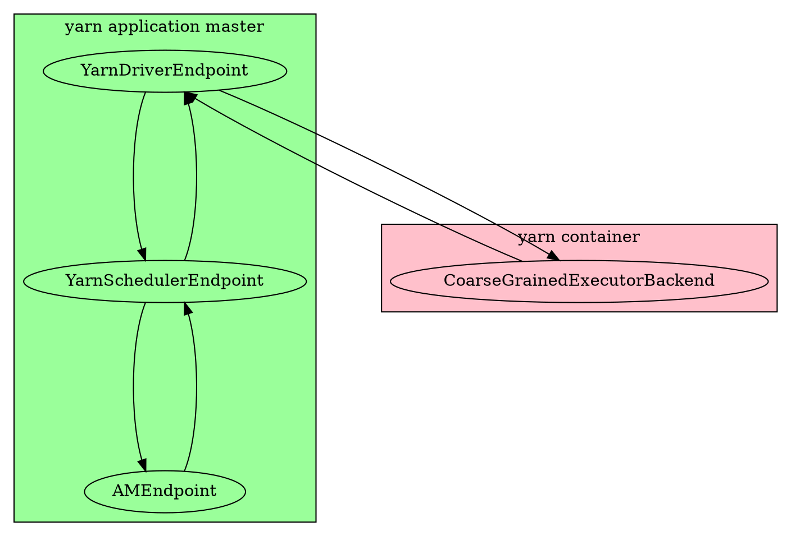
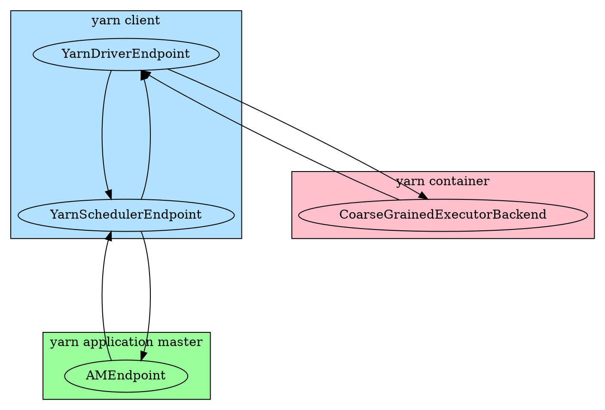

# Spark 运行在 Yarn 的原理 #

## Rpc 服务 ##

Spark运行在Yarn上，会涉及到下列Rpc 服务。YarnDriverEndpoint和YarnSchedulerEndpoint运行在同一个进程

* YarnDriverEndpoint， 继承DriverEndpoint，主要负责与Executor的通信

* YarnSchedulerEndpoint， 负责与AMEndpoint沟通

* AMEndpoint， 运行在ApplicationMaster上，主要负责Yarn的资源请求


### YarnDriverEndpoint ###

YarnDriverEndpoint继承DriverEndpoint， 只是修改了onDisconnected方法，增加了当Executor断开连接时，会去AMEndpoint获取失败日志这一步。

### YarnSchedulerEndpoint ###

YarnSchedulerEndpoint接收下列请求：

来自AMEndpoint的请求

* RegisterClusterManager，请求包含AMEndpoint客户端。
* AddWebUIFilter， 通过它可以做一些控制访问spark web ui 的操作

来自SchedulerBackend的请求， 这些请求都会转发给AMEndpoint

* RequestExecutors， 请求资源
* KillExecutors， 杀死Container
* GetExecutorLossReason， 获取Executor运行的错误信息 

### AMEndpoint ###

AMEndpoint的所有请求都是来自YarnSchedulerEndpoint，接收下列请求：

- RequestExecutors， 请求资源
- KillExecutors， 杀死Container
- GetExecutorLossReason， 获取Executor运行的错误信息 

## ApplicationMaster启动 ##

当yarn的客户端申请到第一个container后，会在这个container启动ApplicationMaster的进程。

```scala
class ApplicationMaster(
    args: ApplicationMasterArguments,
    client: YarnRMClient) {
    
    final def run(): Int = {
    	// 如果是cluster模式， 则调用runDriver
    	if (isClusterMode) {
        	runDriver(securityMgr)
      	} else {
      	// 否则调用runExecutorLauncher
	        runExecutorLauncher(securityMgr)
    	}
    }

					
```


## Yarn运行模式 ##

### cluster模式 ###

cluster模式下，ApplicationMaster会首先启动一个线程，执行用户的程序，里面就包含了sparkContext的初始化。sparkContext在初始化的时候，会运行DriverEndpoint服务。

然后会运行AMEndpoint服务，对外提供资源请求的Rpc接口。主线程会一直等待用户程序执行完，才退出。

这里可以看到，DriverEndpoint和AmEndpoint运行在同一个进程里面。




```scala
def runDriver(securityMgr: SecurityManager): Unit = {
    // 启动用户线程，运行main方法。这里面会完成 sparkContext 的初始化
	userClassThread = startUserApplication()
	val totalWaitTime = sparkConf.get(AM_MAX_WAIT_TIME)
	// 等待 sparkContext 初始化完成
	val sc = ThreadUtils.awaitResult(sparkContextPromise.future,
    	Duration(totalWaitTime, TimeUnit.MILLISECONDS))
    if (sc != null) {
        // 调用rpcEnv创建和运行AMEndpoint
    	rpcEnv = sc.env.rpcEnv
		val driverRef = runAMEndpoint(
         	sc.getConf.get("spark.driver.host"),
      		sc.getConf.get("spark.driver.port"),
      		isClusterMode = true)
         // 向 Yarn 注册ApplicationMaster
		registerAM(sc.getConf, rpcEnv, driverRef, sc.ui.map(_.webUrl), securityMgr)
	} else {
        if (!finished) {
      		throw new IllegalStateException("SparkContext is null but app is still running!")
    	}
	}
	// 等待用户线程执行完
	userClassThread.join()	
}

def startUserApplication(): Thread = {
	// 加载Main函数
	val mainMethod = userClassLoader.loadClass(args.userClass)
		.getMethod("main", classOf[Array[String]])
	val userThread = new Thread {
		override def run() {
			try {
				// 执行Main函数
				mainMethod.invoke(null, userArgs.toArray)
				// 成功执行Main函数后，调用finish做清洗操作
				finish(FinalApplicationStatus.SUCCEEDED, ApplicationMaster.EXIT_SUCCESS)
			}
			.......
		}
	}
	userThread.setContextClassLoader(userClassLoader)
	userThread.setName("Driver")
	// 启动线程
	userThread.start()
	userThread
}
```


 ### client模式 ###

client模式下，用户的程序是运行在spark-submit提交的那台主机上，所以SparkContext和DriverEndpoint都是运行在这台主机上。而ApplicationMaster运行在yarn上的container里。ApplicationMaster这里仅仅是运行AMEndpoint的Rpc服务。

所以在client模式下，DriverEndpoint和AmEndpoint 是不在同一个进程里面的。




```scala
def runExecutorLauncher(securityMgr: SecurityManager): Unit = {
  val port = sparkConf.get(AM_PORT)
  // 实例化 rpcEnv
  rpcEnv = RpcEnv.create("sparkYarnAM", Utils.localHostName, port, sparkConf, securityMgr,
    clientMode = true)
  // 等待DriverEndpoint服务启动，
  val driverRef = waitForSparkDriver()
  registerAM(sparkConf, rpcEnv, driverRef, sparkConf.getOption("spark.driver.appUIAddress"),
    securityMgr)

  // reporterThread会与yarn的ResourceManager保持心跳，知道程序运行结束
  reporterThread.join()
}

def waitForSparkDriver(): RpcEndpointRef = {
    var driverUp = false
    // 解析driverEndpoint的服务地址
    val hostport = args.userArgs(0)
    val (driverHost, driverPort) = Utils.parseHostPort(hostport)
    // 计算超时时间
    val totalWaitTimeMs = sparkConf.get(AM_MAX_WAIT_TIME)
    val deadline = System.currentTimeMillis + totalWaitTimeMs
    
    // 不停的尝试socket连接，查看是否服务已经启动
    while (!driverUp && !finished && System.currentTimeMillis < deadline) {
    	try {
            // 这里新建socket，会自动连接，如果没有出错，则说明正常连接
            val socket = new Socket(driverHost, driverPort)
            socket.close()
            driverUp = true
        } catch {
            // 等待100ms
            case e: Exception =>
            	Thread.sleep(100L)
        }
    }
    
    if (!driverUp) {
    	throw new SparkException("Failed to connect to driver!")
    }
    sparkConf.set("spark.driver.host", driverHost)
    sparkConf.set("spark.driver.port", driverPort.toString)
    // 运行AMEndpoint服务
    runAMEndpoint(driverHost, driverPort.toString, isClusterMode = false)
}
```


## AMEndpoint 启动 ##

AMEndpoint是只和YarnSchedulerEndpoint通信，它在启动之后会发送RegisterClusterManager消息给YarnSchedulerEndpoint，消息会携带AMEndpoint客户端。这样YarnSchedulerEndpoint就可以通过它与AMEndpoint通信了。

```scala
class ApplicationMaster(.... ) {
  private def runAMEndpoint(
      host: String,
      port: String,
      isClusterMode: Boolean): RpcEndpointRef = {
    // 注意这里实例化的是YarnSchedulerEndpoint
    // AMEndpoint的driverEndpoint是指YarnSchedulerEndpoint， 而不是DriverEndpoint
    val driverEndpoint = rpcEnv.setupEndpointRef(
      RpcAddress(host, port.toInt),
      YarnSchedulerBackend.ENDPOINT_NAME)
    amEndpoint =
      rpcEnv.setupEndpoint("YarnAM", new AMEndpoint(rpcEnv, driverEndpoint, isClusterMode))
    driverEndpoint
  }
}

class AMEndpoint(override val rpcEnv: RpcEnv, driver: RpcEndpointRef, isClusterMode: Boolean)
  	extends RpcEndpoint with Logging {
  	override def onStart(): Unit = {
    	// 向YarnSchedulerEndpoint发送 注册信息
    	driver.send(RegisterClusterManager(self))
  	}
}
```


## Container 启动

每个 Container 申请的内存大小，

```scala
// Executor memory in MB.
protected val executorMemory = sparkConf.get(EXECUTOR_MEMORY).toInt  // 从 EXECUTOR_MEMORY 参数获取

// 计算额外的内存大小
protected val memoryOverhead: Int = sparkConf.get(EXECUTOR_MEMORY_OVERHEAD).getOrElse(
  math.max((MEMORY_OVERHEAD_FACTOR * executorMemory).toInt, MEMORY_OVERHEAD_MIN)).toInt
// Number of cores per executor.
protected val executorCores = sparkConf.get(EXECUTOR_CORES)
// 每个Container的内存大小是 EXECUTOR_MEMORY 加上 额外的内存大小
private[yarn] val resource = Resource.newInstance(executorMemory + memoryOverhead, executorCores)
```


Container 在启动程序的时候，设置了Jvm 的最大堆为EXECUTOR_MEMORY。而java 程序运行时，分为jvm管理的内存和本地内存。jvm 管理的内存也分为多部分，但是堆占的比重很大。EXECUTOR_MEMORY 仅仅只能限制 jvm 管理内存中的堆区域，但是本地内存却无法管理，它属于进程所有，也就是由操作系统管理，而操作系统一般不对进程使用的内存做限制，无非超过了物理机的容量。当然 yarn 会实时监测 Container 运行的内存，如果发现本机内存超标，就会杀死它。

所以Container申请的两部分内存，对应于两部分。EXECUTOR_MEMORY 用于  jvm 管理的堆，而 额外的内存大小用于本地内存。

如果yarn 的内存分配单元为 1GB，而这时设置spark 的 executorMemory 也为1GB，那么因为spark实际申请的内存还要加上额外的内存，那么就会造成 yarn 会分配两个资源，也就是 2GB 的内存。这种情况造成了资源的浪费，虽然多分配的1GB 内存当作本地内存使用了。