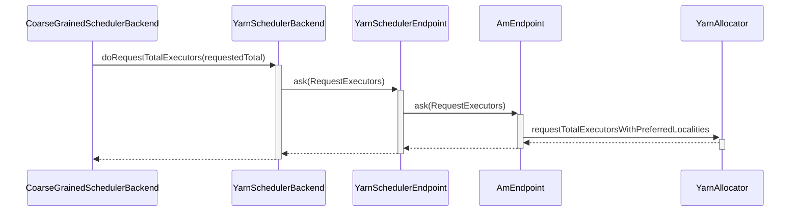

# Spark 运行在 Yarn 的原理 #

# 申请资源 #



## Yarn 运行模式 ##

### ApplicationMaster启动 ###

当yarn的客户端申请到第一个container后，会在这个container启动ApplicationMaster的进程。

```scala
class ApplicationMaster(
    args: ApplicationMasterArguments,
    client: YarnRMClient) {
    
    final def run(): Int = {
    	// 如果是cluster模式， 则调用runDriver
    	if (isClusterMode) {
        	runDriver(securityMgr)
      	} else {
      	// 否则调用runExecutorLauncher
	        runExecutorLauncher(securityMgr)
    	}
    }

					
```

### cluster模式 ###

cluster模式下，ApplicationMaster会首先启动一个线程，执行用户的程序，里面就包含了sparkContext的初始化。sparkContext在初始化的时候，会运行DriverEndpoint服务。

然后会运行AMEndpoint服务，对外提供资源请求的Rpc接口。主线程会一直等待用户程序执行完，才退出。

这里可以看到，DriverEndpoint和Application的AmEndpoint运行在同一个进程里面。

```scala
def runDriver(securityMgr: SecurityManager): Unit = {
    // 启动用户线程，运行main方法。这里面会完成 sparkContext 的初始化
	userClassThread = startUserApplication()
	val totalWaitTime = sparkConf.get(AM_MAX_WAIT_TIME)
	// 等待 sparkContext 初始化完成
	val sc = ThreadUtils.awaitResult(sparkContextPromise.future,
    	Duration(totalWaitTime, TimeUnit.MILLISECONDS))
    if (sc != null) {
        // 调用rpcEnv创建和运行AMEndpoint
    	rpcEnv = sc.env.rpcEnv
		val driverRef = runAMEndpoint(
         	sc.getConf.get("spark.driver.host"),
      		sc.getConf.get("spark.driver.port"),
      		isClusterMode = true)
         // 向 Yarn 注册ApplicationMaster
		registerAM(sc.getConf, rpcEnv, driverRef, sc.ui.map(_.webUrl), securityMgr)
	} else {
        if (!finished) {
      		throw new IllegalStateException("SparkContext is null but app is still running!")
    	}
	}
	// 等待用户线程执行完
	userClassThread.join()	
}

def startUserApplication(): Thread = {
	// 加载Main函数
	val mainMethod = userClassLoader.loadClass(args.userClass)
		.getMethod("main", classOf[Array[String]])
	val userThread = new Thread {
		override def run() {
			try {
				// 执行Main函数
				mainMethod.invoke(null, userArgs.toArray)
				// 成功执行Main函数后，调用finish做清洗操作
				finish(FinalApplicationStatus.SUCCEEDED, ApplicationMaster.EXIT_SUCCESS)
			}
			.......
		}
	}
	userThread.setContextClassLoader(userClassLoader)
	userThread.setName("Driver")
	// 启动线程
	userThread.start()
	userThread
}
```


 ### client模式 ###

client模式下，用户的程序是运行在spark-submit提交的那台主机上，所以SparkContext和DriverEndpoint都是运行在这台主机上。而ApplicationMaster运行在yarn上的container里。ApplicationMaster这里仅仅是运行AMEndpoint的Rpc服务。

所以在client模式下，DriverEndpoint和Application的AmEndpoint 是不在同一个进程里面的。

```scala
def runExecutorLauncher(securityMgr: SecurityManager): Unit = {
  val port = sparkConf.get(AM_PORT)
  // 实例化 rpcEnv
  rpcEnv = RpcEnv.create("sparkYarnAM", Utils.localHostName, port, sparkConf, securityMgr,
    clientMode = true)
  // 等待DriverEndpoint服务启动，
  val driverRef = waitForSparkDriver()
  registerAM(sparkConf, rpcEnv, driverRef, sparkConf.getOption("spark.driver.appUIAddress"),
    securityMgr)

  // reporterThread会与yarn的ResourceManager保持心跳，知道程序运行结束
  reporterThread.join()
}

def waitForSparkDriver(): RpcEndpointRef = {
    var driverUp = false
    // 解析driverEndpoint的服务地址
    val hostport = args.userArgs(0)
    val (driverHost, driverPort) = Utils.parseHostPort(hostport)
    // 计算超时时间
    val totalWaitTimeMs = sparkConf.get(AM_MAX_WAIT_TIME)
    val deadline = System.currentTimeMillis + totalWaitTimeMs
    
    // 不停的尝试socket连接，查看是否服务已经启动
    while (!driverUp && !finished && System.currentTimeMillis < deadline) {
    	try {
            // 这里新建socket，会自动连接，如果没有出错，则说明正常连接
            val socket = new Socket(driverHost, driverPort)
            socket.close()
            driverUp = true
        } catch {
            // 等待100ms
            case e: Exception =>
            	Thread.sleep(100L)
        }
    }
    
    if (!driverUp) {
    	throw new SparkException("Failed to connect to driver!")
    }
    sparkConf.set("spark.driver.host", driverHost)
    sparkConf.set("spark.driver.port", driverPort.toString)
    // 运行AMEndpoint服务
    runAMEndpoint(driverHost, driverPort.toString, isClusterMode = false)
}
```


## AMEndpoint 服务 ##

AMEndpoint 继承 RpcEndpoint, 表示Rpc服务，它接收下列请求：

* RequestExecutors， 请求资源
* KillExecutors， 杀死Container
* GetExecutorLossReason， 获取Executor运行的错误信息


## YarnAllocator ##

AMEndpoint关于资源的请求，都会转发给YarnAllocator处理。YarnAllocator主要负责ApplicationMaster和ResourceManager的通信。

首先简单的介绍下AMRMClient的使用，它是Yarn库里的类，提供了与ResourceManager通信的api。

```java
// 实例化AMRMClient
AMRMClient<ContainerRequest> amClient = AMRMClient.createAMRMClient();
// 指定请求资源大小，内存和cpu
Resource resource = Resource.newInstance(memory, cores);
// 希望请求所在的主机
String[] nodes = {"node1", "node2"};
// 希望请求所在的机架，如果没有要求，则设为null
String[] rack = null;
// 指定优先值
Priority priority = Priority.newInstance(1);
// 当资源不满足时，是否可以降级要求。比如指定主机node1不满足时，可以降级到node1所在机架的其它主机
Boolean relaxLocality = True;
// 实例化 ContainerRequest
ContainerRequest request = new ContainerRequest(resources, nodes, rack, priority);
// 添加 ContainerRequest 到 amClient里，等待allocate函数发出申请
amClient.addContainerRequest(request);
// allocate会将ContainerRequest请求发送给ResourceManager，同时也会维持心跳
amClient.allocate(0.1);
```

